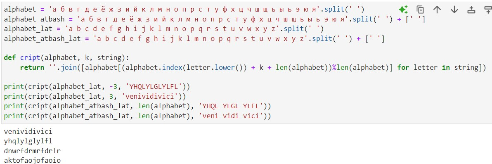

---
## Front matter
title: "Отчет по лабораторной работе №1"
subtitle: "Дисциплина: Математические основы защиты информации и информационной безопасности"
author: "Живцова Анна"

## Generic otions
lang: ru-RU
toc-title: "Содержание"

## Bibliography
bibliography: cite.bib
csl: pandoc/csl/gost-r-7-0-5-2008-numeric.csl

## Pdf output format
toc: true # Table of contents
toc-depth: 2
lof: true # List of figures
lot: true # List of tables
fontsize: 12pt
linestretch: 1.5
papersize: a4
documentclass: scrreprt
## I18n polyglossia
polyglossia-lang:
  name: russian
  options:
	- spelling=modern
	- babelshorthands=true
polyglossia-otherlangs:
  name: english
## I18n babel
babel-lang: russian
babel-otherlangs: english
## Fonts
mainfont: IBM Plex Serif
romanfont: IBM Plex Serif
sansfont: IBM Plex Sans
monofont: IBM Plex Mono
mathfont: STIX Two Math
mainfontoptions: Ligatures=Common,Ligatures=TeX,Scale=0.94
romanfontoptions: Ligatures=Common,Ligatures=TeX,Scale=0.94
sansfontoptions: Ligatures=Common,Ligatures=TeX,Scale=MatchLowercase,Scale=0.94
monofontoptions: Scale=MatchLowercase,Scale=0.94,FakeStretch=0.9
mathfontoptions:
## Biblatex
biblatex: true
biblio-style: "gost-numeric"
biblatexoptions:
  - parentracker=true
  - backend=biber
  - hyperref=auto
  - language=auto
  - autolang=other*
  - citestyle=gost-numeric
## Pandoc-crossref LaTeX customization
figureTitle: "Рис."
tableTitle: "Таблица"
listingTitle: "Листинг"
lofTitle: "Список иллюстраций"
lotTitle: "Список таблиц"
lolTitle: "Листинги"
## Misc options
indent: true
header-includes:
  - \usepackage{indentfirst}
  - \usepackage{float} # keep figures where there are in the text
  - \floatplacement{figure}{H} # keep figures where there are in the text
---

# Цель работы

Изучить алгоритмы шифрования с помощью простой замены. Реализовать шифрование и дешифрование шифра Цезаря и шифра Атбаш.

# Задание

Реализовать шифрование и дешифрование шифра Цезаря и шифра Атбаш.


# Теоретическое введение

Шифры простой замены (подстановки) реализуются с помощью таблицы, состоящей из двух строк. В первой строке указываются символы исходного алфавита, во второй строке перечисляются символы шифроалфавита (часто являющиеся символами исходного алфавита, перечисленными в ином порядке). Каждому символу исходного алфавита ставится в соответствие символ шифроалфавита. Для шифрования текста все символы исходного сообщения (написанного с помощью исходного алфавита) заменяются на соответствующие символы шифроалфавита. Для дешифрования, наоборот, в все символы в шифростроке (состоящей из символов шифроалфавита) ставятся в соответствие символы исходного алфавита [@book; @book2]. 

В шифре Цезаря шифроалфавит представляет собой исходный алфавит, циклически смещенный на k символов. В шифре Атабаш исходный алфавит кроме букв содержит еще и символ пробела, а шифроалфавит является исходным алфавитом, записанным в обратном порядке. 

# Выполнение лабораторной работы

Для реализации шифрования и дешифрования шифров Цезаря и Атбаш на языке Python была написанна следующая функция. 

```
def cript(alphabet, k, string):
    return ''.join([alphabet[(alphabet.index(letter.lower()) + k)%len(alphabet)] for letter in string]) ```  


Тут k -- параметр смещения алфавита для шифра Цезаря. Для шифрования k > 0. Для дешифрования k < 0. Для шифра Атбаш ```k = len(alphabet)```.

Функциональность данной функции была протестирована в среде jupyter notebook (см. рис. [-@fig:001]).

{#fig:001}

# Выводы

В данной работе я изучила алгоритмы шифрования с помощью простой замены, а также реализовала шифрование и дешифрование шифра Цезаря и шифра Атбаш.

# Список литературы{.unnumbered}

::: {#refs}
:::
