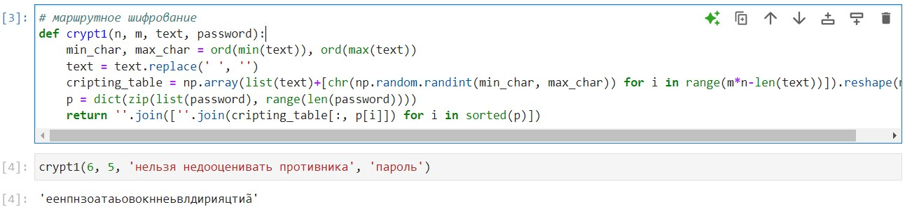
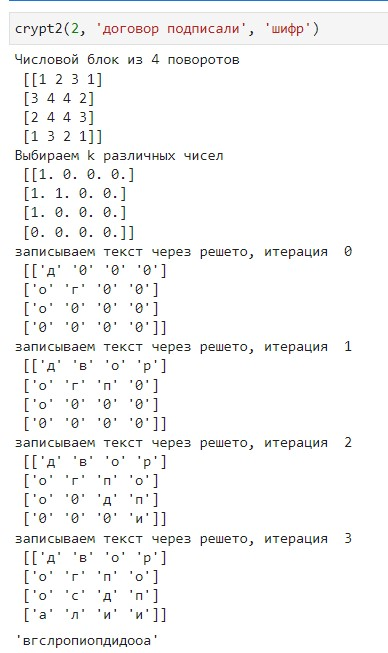
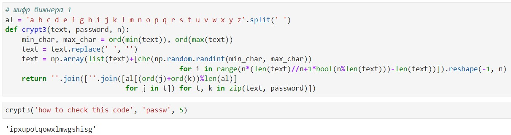
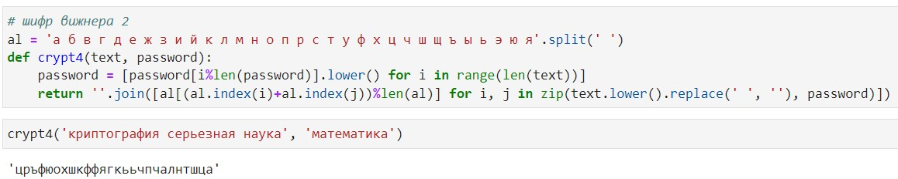

---
## Front matter
lang: ru-RU
title: Презентация по лабораторной работе №2
subtitle: Дисциплина "Математические основы защиты информации и информационной безопасности"
author:
  - Живцова А.А.
institute:
  - Кафедра теории вероятностей и кибербезопасности, Российский университет дружбы народов имени Патриса Лумумбы, Москва, Россия
date: 28 сентября 2024

## i18n babel
babel-lang: russian
babel-otherlangs: english

## Formatting pdf
toc: false
toc-title: Содержание
slide_level: 2
aspectratio: 169
section-titles: true
theme: metropolis
header-includes:
 - \metroset{progressbar=frametitle,sectionpage=progressbar,numbering=fraction}
---

# Информация

## Докладчик

:::::::::::::: {.columns align=center}
::: {.column width="70%"}

  * Живцова Анна Александровна
  * студент кафедры теории вероятностей и кибербезопасности
  * Российский университет дружбы народов имени Патриса Лумумбы
  * [zhivtsova_aa@pfur.ru](mailto:zhivtsova_aa@pfur.ru)
  * <https://github.com/AnnaZhiv>

:::
::: {.column width="30%"}

:::
::::::::::::::

# Вводная часть

## Актуальность

Шифры перестановки служат примером традиционного симметричного шифрования. Хотя для многих таких шифров существуют методы взлома, изучение этих шифров улучшает понимание концепции симметричного шифрования, а реализация шифров на практике позволяет оценить вычислительную сложность.  

## Объект и предмет исследования

- Шифрование с помощью маршрутов    
- Шифрование с помощью решеток      
- Шифр Виженера         

## Цели и задачи

- Изучить концепцию шифров перестановки      
- Реализовать шифрование с помощью маршрутов, шифрование с помощью решеток, и шифрование Виженера.      

## Материалы и методы

- Язык программирования Python    

# Результаты

## Шифрование с помощью маршрутов

{width=90%}

## Шифрование с помощью решеток

{width=90%}

## Шифр Виженера. Тип 1

{width=90%}

## Шифр Виженера. Тип 2

{width=90%}