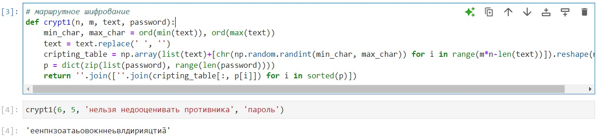
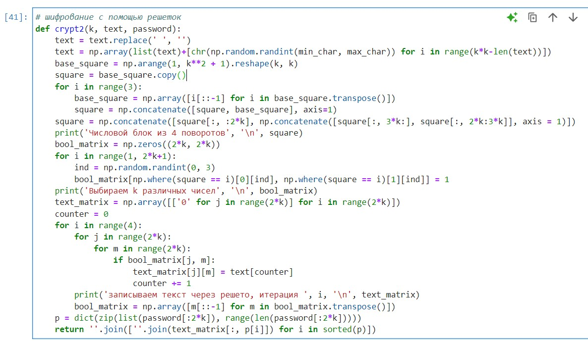
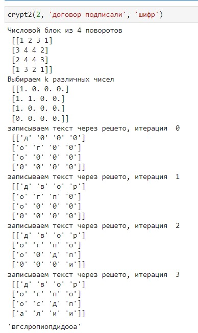
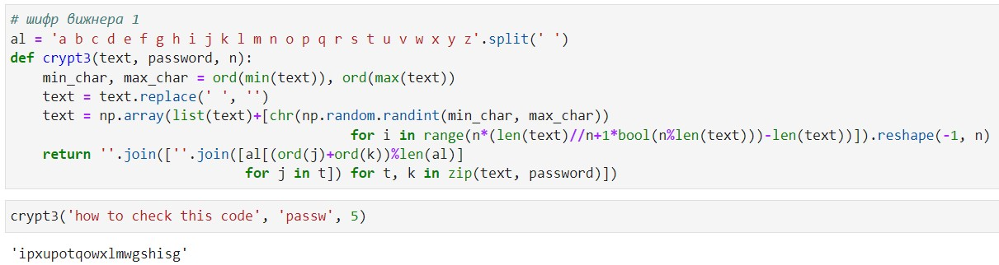
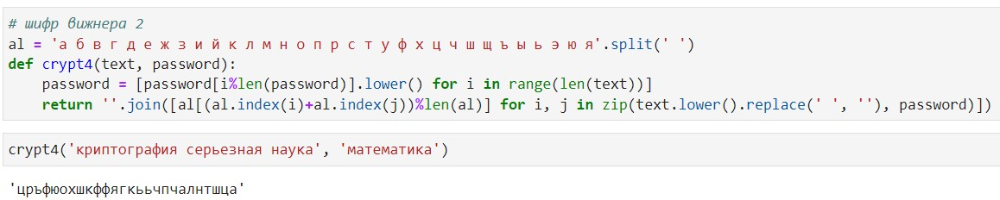

---
## Front matter
title: "Отчет по лабораторной работе №2"
subtitle: "Дисциплина: Математические основы защиты информации и информационной безопасности"
author: "Живцова Анна"

## Generic otions
lang: ru-RU
toc-title: "Содержание"

## Bibliography
bibliography: cite.bib
csl: pandoc/csl/gost-r-7-0-5-2008-numeric.csl

## Pdf output format
toc: true # Table of contents
toc-depth: 2
lof: true # List of figures
lot: true # List of tables
fontsize: 12pt
linestretch: 1.5
papersize: a4
documentclass: scrreprt
## I18n polyglossia
polyglossia-lang:
  name: russian
  options:
	- spelling=modern
	- babelshorthands=true
polyglossia-otherlangs:
  name: english
## I18n babel
babel-lang: russian
babel-otherlangs: english
## Fonts
mainfont: IBM Plex Serif
romanfont: IBM Plex Serif
sansfont: IBM Plex Sans
monofont: IBM Plex Mono
mathfont: STIX Two Math
mainfontoptions: Ligatures=Common,Ligatures=TeX,Scale=0.94
romanfontoptions: Ligatures=Common,Ligatures=TeX,Scale=0.94
sansfontoptions: Ligatures=Common,Ligatures=TeX,Scale=MatchLowercase,Scale=0.94
monofontoptions: Scale=MatchLowercase,Scale=0.94,FakeStretch=0.9
mathfontoptions:
## Biblatex
biblatex: true
biblio-style: "gost-numeric"
biblatexoptions:
  - parentracker=true
  - backend=biber
  - hyperref=auto
  - language=auto
  - autolang=other*
  - citestyle=gost-numeric
## Pandoc-crossref LaTeX customization
figureTitle: "Рис."
tableTitle: "Таблица"
listingTitle: "Листинг"
lofTitle: "Список иллюстраций"
lotTitle: "Список таблиц"
lolTitle: "Листинги"
## Misc options
indent: true
header-includes:
  - \usepackage{indentfirst}
  - \usepackage{float} # keep figures where there are in the text
  - \floatplacement{figure}{H} # keep figures where there are in the text
---

# Цель работы

Изучить алгоритмы шифрования с помощью перестановки. Реализовать шифрование с помощью маршрутов, шифрование с помощью решеток, и шифрование Виженера.

# Задание

Реализовать шифрование с помощью маршрутов, шифрование с помощью решеток, и шифрование Виженера.

# Теоретическое введение

Шифры перестановки преобразуют открытый текст в криптограмму путем перестановки его символов. Подробнее в источниках [@book; @book2].

Маршрутное шифрование реализуется следующим образом. Исходный текст построчно записывается в таблицу размера $n \times m$. При недостатке символов исходного текста свободные места в таблице заполняются произвольными символами. В последнюю $n+1$ строчку таблицы записывается пароль. Символы из таблицы считываются по столбцам, отсортированным по последнему элементу (букве пароля), формируя зашифрованный текст.

Шифрование с помощью решеток. Таблица размера $k \times k$ заполняется различными числами от 1 до $k^2$. Далее эту таблицу три раза поворачивают на 90 градусов и из полученных четырех таблиц, отличающихся только поворотом, формируют таблицу размером $2k \times 2k$. Из этой таблицы случайно выбирается $k^2$ различных чисел. Исходный текст записывается в пустую таблицу в ячейки, которые соответствуют выбранным $k^2$ числам. Далее таблица  $2k \times 2k$ переворачивается. Операция повторяется еще три раза. К полученной заполненной таблице в последней строке приписывается пароль. Символы из таблицы считываются по столбцам, отсортированным по последнему элементу (букве пароля), формируя зашифрованный текст.

Шифр Виженера. Тип 1. Исходный текст разибается на блоки длины $n$ (если символов не хватает, то дописываются произвольные). Каждый блок циклически сдвигается по алфавиту на величину $a_i$.  

Шифр Виженера. Тип 2. Задана таблица в которой каждая строчка $i$ представляет собой алфавит циклически сдвинутый на $i$ позиций. Посредством циклического повторения пароля формируется кодовое слово $key$, по длине равное исходному тексту $text$. Символ под номером $i$ исходного текста шифруется с помощью символа таблицы, стоящего в столбце, начинающемся на символ $key[i]$, и строке, начинающейся на символ $text[i]$.

# Выполнение лабораторной работы

## Маршрутное шифрование    

Для реализации маршрутного шифрования  на языке Python была написанна следующая функция. 

```python
def crypt1(n, m, text, password):      
    min_char, max_char = ord(min(text)), ord(max(text))      
    text = text.replace(' ', '')      
    cripting_table = np.array(list(text)+[chr(np.random.randint(min_char, max_char)) for i in range(m*n-len(text))]).reshape(m, n)      
    p = dict(zip(list(password), range(len(password))))      
    return ''.join([''.join(cripting_table[:, p[i]]) for i in sorted(p)])      
```  


Тут $n$ и $m$ -- размеры кодовой таблицы. Переменная $password$ отвечает за пароль, а переменная $text$ за исходный текст.

Функциональность данной функции была протестирована в среде jupyter notebook (см. рис. [-@fig:001]).

{#fig:001}

## Шифрование с помощью решеток

Реализовано с помощью функции 

```python
def crypt2(k, text, password):      
    text = text.replace(' ', '')      
    text = np.array(list(text)+[chr(np.random.randint(min_char, max_char)) for i in range(k*k-len(text))])      
    base_square = np.arange(1, k**2 + 1).reshape(k, k)      
    square = base_square.copy()      
    for i in range(3):      
        base_square = np.array([i[::-1] for i in base_square.transpose()])      
        square = np.concatenate([square, base_square], axis=1)      
    square = np.concatenate([square[:, :2*k], np.concatenate([square[:, 3*k:], square[:, 2*k:3*k]], axis = 1)])      
    print('Числовой блок из 4 поворотов', '\n', square)      
    bool_matrix = np.zeros((2*k, 2*k))      
    for i in range(1, 2*k+1):      
        ind = np.random.randint(0, 3)      
        bool_matrix[np.where(square == i)[0][ind], np.where(square == i)[1][ind]] = 1      
    print('Выбираем k различных чисел', '\n', bool_matrix)      
    text_matrix = np.array([['0' for j in range(2*k)] for i in range(2*k)])      
    counter = 0      
    for i in range(4):      
        for j in range(2*k):      
            for m in range(2*k):      
                if bool_matrix[j, m]:      
                    text_matrix[j][m] = text[counter]      
                    counter += 1      
        print('записываем текст через решето, итерация ', i, '\n', text_matrix)      
        bool_matrix = np.array([m[::-1] for m in bool_matrix.transpose()])      
    p = dict(zip(list(password[:2*k]), range(len(password[:2*k]))))      
    return ''.join([''.join(text_matrix[:, p[i]]) for i in sorted(p)])      
```

Функция была протестирована функции (см. рис. [-@fig:002]).

{#fig:002}

{#fig:003}

## Шифр Вижнера. Тип 1

Реализован с помощью функции  

```python
al = 'a b c d e f g h i j k l m n o p q r s t u v w x y z'.split(' ')      
def crypt3(text, password, n):      
    min_char, max_char = ord(min(text)), ord(max(text))      
    text = text.replace(' ', '')      
    text = np.array(list(text)+[chr(np.random.randint(min_char, max_char))       
                                          for i in range(n*(len(text)//n+1*bool(n%len(text)))-len(text))]).reshape(-1, n)      
    return ''.join([''.join([al[(ord(j)+ord(k))%len(al)]      
                             for j in t]) for t, k in zip(text, password)])      
```

Функция была протестирована функции (см. рис. [-@fig:004]).

{#fig:004}

## Шифр Вижнера. Тип 2

Реализован с помощью функции  

```python
al = 'а б в г д е ж з и й к л м н о п р с т у ф х ц ч ш щ ъ ы ь э ю я'.split(' ')      
def crypt4(text, password):      
    password = [password[i%len(password)].lower() for i in range(len(text))]      
    return ''.join([al[(al.index(i)+al.index(j))%len(al)] for i, j in zip(text.lower().replace(' ', ''), password)])      
```

Функция была протестирована функции (см. рис. [-@fig:005]).

{#fig:005}

# Выводы

В данной работе я изучила алгоритмы шифрования с помощью перестановки. Реализовала и протестировала шифрование с помощью маршрутов, шифрование с помощью решеток, и шифрование Виженера.

# Список литературы{.unnumbered}

::: {#refs}
:::
