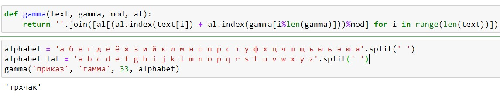

---
## Front matter
title: "Отчет по лабораторной работе №3"
subtitle: "Дисциплина: Математические основы защиты информации и информационной безопасности"
author: "Живцова Анна"

## Generic otions
lang: ru-RU
toc-title: "Содержание"

## Bibliography
bibliography: cite.bib
csl: pandoc/csl/gost-r-7-0-5-2008-numeric.csl

## Pdf output format
toc: true # Table of contents
toc-depth: 2
lof: true # List of figures
lot: true # List of tables
fontsize: 12pt
linestretch: 1.5
papersize: a4
documentclass: scrreprt
## I18n polyglossia
polyglossia-lang:
  name: russian
  options:
	- spelling=modern
	- babelshorthands=true
polyglossia-otherlangs:
  name: english
## I18n babel
babel-lang: russian
babel-otherlangs: english
## Fonts
mainfont: IBM Plex Serif
romanfont: IBM Plex Serif
sansfont: IBM Plex Sans
monofont: IBM Plex Mono
mathfont: STIX Two Math
mainfontoptions: Ligatures=Common,Ligatures=TeX,Scale=0.94
romanfontoptions: Ligatures=Common,Ligatures=TeX,Scale=0.94
sansfontoptions: Ligatures=Common,Ligatures=TeX,Scale=MatchLowercase,Scale=0.94
monofontoptions: Scale=MatchLowercase,Scale=0.94,FakeStretch=0.9
mathfontoptions:
## Biblatex
biblatex: true
biblio-style: "gost-numeric"
biblatexoptions:
  - parentracker=true
  - backend=biber
  - hyperref=auto
  - language=auto
  - autolang=other*
  - citestyle=gost-numeric
## Pandoc-crossref LaTeX customization
figureTitle: "Рис."
tableTitle: "Таблица"
listingTitle: "Листинг"
lofTitle: "Список иллюстраций"
lotTitle: "Список таблиц"
lolTitle: "Листинги"
## Misc options
indent: true
header-includes:
  - \usepackage{indentfirst}
  - \usepackage{float} # keep figures where there are in the text
  - \floatplacement{figure}{H} # keep figures where there are in the text
---

# Цель работы

Изучить алгоритм шифрования гаммированием. Реализовать шифрование с помощью конечной гаммы.

# Задание

Реализовать шифрование с помощью конечной гаммы.

# Теоретическое введение

Известно, что простейшей и наиболее надежной хемой шифрования является схема однократного использования. Однако в данной схеме длина ключа совпадает с длиной передаваемых данных, что затруднительно. Отсюда вытекает идея гаммирования.

Гаммирование — это метод симметричного шифрования, заключающийся в «наложении» последовательности, состоящей из случайных чисел, на открытый текст. Подробнее в источниках [@book; @book2].

В данной работе будем использовать конечную гамму, в которой ключ формируется повторением заданного конечного слова. В таком шифровании из символа  исходного текста $y_i$, которому соответствует символ гаммы $g_i$, получается зашифрованный символ $c_i = (y_i+g_i)$mod$x$.      

# Выполнение лабораторной работы

Для реализации шифрования с помощью гаммирования на языке Python была написанна следующая функция. 

```python
def gamma(text, gamma, mod, al):     
    return ''.join([al[(al.index(text[i]) + al.index(gamma[i%len(gamma)]))%mod] for i in range(len(text))])        
```  

Тут $al$ -- это алфавит, $mod$ -- это основание для сложения по модулю, $text$ -- это исходный текст, а $gamma$ -- это строка гаммы (ключ).

Функциональность данной функции была протестирована в среде jupyter notebook (см. рис. [-@fig:001]).

{#fig:001}

# Выводы

В данной работе я изучила алгоритм шифрования гаммированием и реализовала шифрование с помощью конечной гаммы.

# Список литературы{.unnumbered}

::: {#refs}
:::
