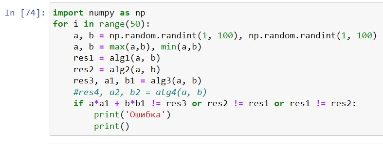

---
## Front matter
title: "Отчет по лабораторной работе №4"
subtitle: "Дисциплина: Математические основы защиты информации и информационной безопасности"
author: "Живцова Анна"

## Generic otions
lang: ru-RU
toc-title: "Содержание"

## Bibliography
bibliography: cite.bib
csl: pandoc/csl/gost-r-7-0-5-2008-numeric.csl

## Pdf output format
toc: true # Table of contents
toc-depth: 2
lof: true # List of figures
lot: true # List of tables
fontsize: 12pt
linestretch: 1.5
papersize: a4
documentclass: scrreprt
## I18n polyglossia
polyglossia-lang:
  name: russian
  options:
	- spelling=modern
	- babelshorthands=true
polyglossia-otherlangs:
  name: english
## I18n babel
babel-lang: russian
babel-otherlangs: english
## Fonts
mainfont: IBM Plex Serif
romanfont: IBM Plex Serif
sansfont: IBM Plex Sans
monofont: IBM Plex Mono
mathfont: STIX Two Math
mainfontoptions: Ligatures=Common,Ligatures=TeX,Scale=0.94
romanfontoptions: Ligatures=Common,Ligatures=TeX,Scale=0.94
sansfontoptions: Ligatures=Common,Ligatures=TeX,Scale=MatchLowercase,Scale=0.94
monofontoptions: Scale=MatchLowercase,Scale=0.94,FakeStretch=0.9
mathfontoptions:
## Biblatex
biblatex: true
biblio-style: "gost-numeric"
biblatexoptions:
  - parentracker=true
  - backend=biber
  - hyperref=auto
  - language=auto
  - autolang=other*
  - citestyle=gost-numeric
## Pandoc-crossref LaTeX customization
figureTitle: "Рис."
tableTitle: "Таблица"
listingTitle: "Листинг"
lofTitle: "Список иллюстраций"
lotTitle: "Список таблиц"
lolTitle: "Листинги"
## Misc options
indent: true
header-includes:
  - \usepackage{indentfirst}
  - \usepackage{float} # keep figures where there are in the text
  - \floatplacement{figure}{H} # keep figures where there are in the text
---

# Цель работы

Изучить алгоритмы вычисления наибольшего общего делителя. Реализовать их.

# Задание

Реализовать поиск наибольшего общего делителя с помощью алгоритма Евклида, бинарного алгоритма Евклида, расширенного алгоритма Евклида и бинарного расширенного алгоритма Евклида.

# Теоретическое введение

Наибольший общий делитель чисел, позволяющий, например, определять взаимно простые числа, используется в криптографии. Подробнее в источниках [@book; @book2].

Наибольшим общим делителем (НОД) двух натуральных чисел называют такое наибольшее натуральное число, на которое нацело делятся два данных числа. Если наибольший общий делитель двух натуральных чисел равен , то такие числа называют взаимно простыми.

Интересно, что НОД чисел можно выразить в виде их линейной комбинации с целыми коэффициентами.

# Выполнение лабораторной работы

Далее везде решаем задачу поиска НОД между числами  $b \le a.$ 

## Алгоритм Евклида   

Для реализации алгоритма Евклида на языке Python была написанна следующая функция. 

```python
def alg1(a, b):
    while b != 0:
        a = a%b
        a, b = b, a
    return a      
```  

## Бинарный алгоритм Евклида

Реализован с помощью функции 

```python
def alg2(a, b):
    a, b = max(a,b), min(a,b)
    if b == 0:
        return a
    if b == 1:
        return 1
    if b == a:
        return b
    g = 1
    while (a%2 + b%2) == 0:
        a /= 2
        b /= 2
        g *= 2
    while a%2 == 0:
        a /= 2
    while b%2 == 0:
        b /= 2
    return g*alg2((a-b)/2, b) if a >= b else g*alg2(a, (b-a)/2)      
```

## Расширенный алгоритм Евклида

Алгоритм называется расширенным так как возвращает дополнительно числа $x$ и $y$ такие что НОД(a, b) = $xa + yb.$ Алгоритм реализован с помощью функции  

```python
def alg3(a, b):
    x0 = 1; x1 = 0; y0 = 0; y1 = 1;
    while b != 0:
        x0 -= (a//b)*x1
        y0 -= (a//b)*y1
        a = a%b
        a, b = b, a
        x0, x1 = x1, x0
        y0, y1 = y1, y0
    return a, x0, y0
```

## Бинарный расширенный алгоритм Евклида

В виде, предложенном в методических рекомендациях, реализован с помощью функции  

```python
def alg4(a, b):
    g = 1
    while a%2 + b%2 == 0:
        a /= 2
        b /= 2
        g *= 2
    u = a; v = b; A = 1; B = 0; C = 0; D = 1;
    while u%2 == 0:
        u /= 2
        if A%2 + B%2 == 0:
            A /=2 
            B /=2
        else:
            A = (A + b)/2
            B = (B - a)/2
    while v%2 == 0:
        v /= 2
        if C%2 + D%2 == 0:
            C /=2 
            D /=2
        else:
            C = (C + b)/2
            D = (D - a)/2
    if u <= v:
        v = v - u 
        C = C - A
        D = D - B
    return g*v, C, D     
```

## Проверка написанных алгоритмов

Функциональность данных функций была протестирована в среде jupyter notebook (см. рис. [-@fig:001]).

{#fig:001}

# Выводы

В данной работе я изучила алгоритмы вычисления НОД. Реализовала поиск НОД с помощью алгоритма Евклида, бинарного алгоритма Евклида, расширенного алгоритма Евклида и бинарного расширенного алгоритма Евклида. Проверила правильность написанных программ. 

# Список литературы{.unnumbered}

::: {#refs}
:::
