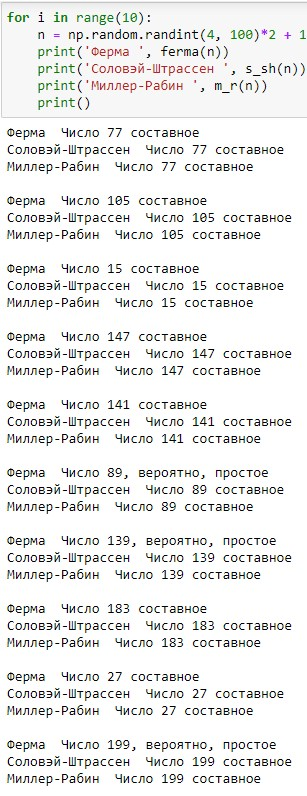

---
## Front matter
title: "Отчет по лабораторной работе №5"
subtitle: "Дисциплина: Математические основы защиты информации и информационной безопасности"
author: "Живцова Анна"

## Generic otions
lang: ru-RU
toc-title: "Содержание"

## Bibliography
bibliography: cite.bib
csl: pandoc/csl/gost-r-7-0-5-2008-numeric.csl

## Pdf output format
toc: true # Table of contents
toc-depth: 2
lof: true # List of figures
lot: true # List of tables
fontsize: 12pt
linestretch: 1.5
papersize: a4
documentclass: scrreprt
## I18n polyglossia
polyglossia-lang:
  name: russian
  options:
	- spelling=modern
	- babelshorthands=true
polyglossia-otherlangs:
  name: english
## I18n babel
babel-lang: russian
babel-otherlangs: english
## Fonts
mainfont: IBM Plex Serif
romanfont: IBM Plex Serif
sansfont: IBM Plex Sans
monofont: IBM Plex Mono
mathfont: STIX Two Math
mainfontoptions: Ligatures=Common,Ligatures=TeX,Scale=0.94
romanfontoptions: Ligatures=Common,Ligatures=TeX,Scale=0.94
sansfontoptions: Ligatures=Common,Ligatures=TeX,Scale=MatchLowercase,Scale=0.94
monofontoptions: Scale=MatchLowercase,Scale=0.94,FakeStretch=0.9
mathfontoptions:
## Biblatex
biblatex: true
biblio-style: "gost-numeric"
biblatexoptions:
  - parentracker=true
  - backend=biber
  - hyperref=auto
  - language=auto
  - autolang=other*
  - citestyle=gost-numeric
## Pandoc-crossref LaTeX customization
figureTitle: "Рис."
tableTitle: "Таблица"
listingTitle: "Листинг"
lofTitle: "Список иллюстраций"
lotTitle: "Список таблиц"
lolTitle: "Листинги"
## Misc options
indent: true
header-includes:
  - \usepackage{indentfirst}
  - \usepackage{float} # keep figures where there are in the text
  - \floatplacement{figure}{H} # keep figures where there are in the text
---

# Цель работы

Изучить вероятностные алгоритмы проверки чисел на простоту.

# Задание

Реализовать алгоритмы тестов Ферма, Соловэя-Штрассена, Миллера-Рабина.

# Теоретическое введение

Простые числа широко применяются в криптографии с открытым ключем. Подробнее в источниках [@book; @book2]. Алгоритмы проверки на простоту можно разделить на детерминированные и вероятностные. Вероятностные, возможно, вычислительно менее сложные, однако они позволяют дать ответ лишь с некоторой вероятностью. Иногда этого бывает достаточно. Рассмотрим несколько вероятностных тстов на простоту и приведем ключевые факты, на которых основаны тесты. Дале $p$ -- простое число, и $a \in [2, p-1]$ -- произвольное число. 

**Тест Ферма.** основан на следующем факте     
 $$a^{p-1} \equiv 1(mod \ p) \forall a.$$

**Тест Соловэя-Штрассена.** основан на критерии Эйлера     
> $$a^{\frac{p-1}{2}} \equiv \left(\frac{a}{p}\right)(mod \ p) \forall a.$$

**Тест Миллера-Рабина.** основан на тесте Ферма. 

# Выполнение лабораторной работы

В этом разделе $n$ -- число, которое требуется проверить на простоту. $n$ нечетно и больше 5.

## Тест Ферма    

Для реализации теста Ферма на языке Python была написанна следующая функция. 

```python
def ferma(n):
    a = np.random.randint(2, n-2)
    if (a**(n-1))%n == 1:
        return 'Число {}, вероятно, простое'.format(n)
    else:
        return 'Число {} составное'.format(n) 
```  

## Тест Соловэя-Штрассена

Для реализации теста отдельно была реализована функция рассчета символя Якоби

```python
def yakoby(n, a, g = 1):
    if a == 0:
        return 0
    if a == 1:
        return g
    k = 0
    a1 = a
    while a1%2 == 0:
        k += 1
        a1 /=2
    if k%2 == 0:
        s = 1
    elif n%8 == 1 or n%8 == 7:
        s = 1
    elif n%8 == 3 or n%8 == 5:
        s = -1
    if a == 1:
        return g*s
    if n%4 == 3 and a1%4 == 3:
        s *= -1
    a = n%a1
    n = a1
    g *= s
    return yakoby(n, a, g)
```

Сам тест реализован с помощью функции 

```python
def s_sh(n):
    a = np.random.randint(2, n-2)
    r = a**((n-1)/2)
    if r != 1 and r!= n-1:
        return 'Число {} составное'.format(n)
    else:
        s = yakoby(n, a)
        if r%n == s:
            return 'Число {} составное'.format(n)
        return 'Число {}, вероятно, простое'.format(n)
```

## Тест Миллера-Рабина

Данный тест реализован с помощью функции  

```python
def m_r(n):
    s = 0
    r = n-1
    while r%2 == 0:
        s += 1
        r /=2
    a = np.random.randint(2, n-2)
    y = (a**r)%n
    if y != 1 and y != n - 1:
        for j in range(1, s):
            if y != n - 1 and (y*y)%n == 1:
                return 'Число {} составное'.format(n)
        if y != n - 1:
            return 'Число {} составное'.format(n)
    return 'Число {}, вероятно, простое'.format(n)
```

## Тестирование реализованных алгоритмов

Проведено тестирование реализованных алгоритмов. Видно, что в большинстве случаев ответы различных тестов совпадают, однако иногда делается ошибочное предположение о простоте (см. рис. [-@fig:001]).

{#fig:001}

# Выводы

В данной работе я изучила вероятностные алгоритмы проверки чисел на простоту. Реализовала тесты Ферма, Соловэя-Штрассена, Миллера-Рабина. Протестировала реализованные функции. 

Таким образом, задачи работы были выполнены, а цели достигнуты.

# Список литературы{.unnumbered}

::: {#refs}
:::
