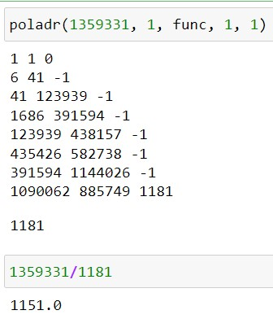

---
## Front matter
lang: ru-RU
title: Презентация по лабораторной работе №6
subtitle: Дисциплина "Математические основы защиты информации и информационной безопасности"
author:
  - Живцова А.А.
institute:
  - Кафедра теории вероятностей и кибербезопасности, Российский университет дружбы народов имени Патриса Лумумбы, Москва, Россия
date: 10 октября 2024

## i18n babel
babel-lang: russian
babel-otherlangs: english

## Formatting pdf
toc: false
toc-title: Содержание
slide_level: 2
aspectratio: 169
section-titles: true
theme: metropolis
header-includes:
 - \metroset{progressbar=frametitle,sectionpage=progressbar,numbering=fraction}
---

# Информация

## Докладчик

:::::::::::::: {.columns align=center}
::: {.column width="70%"}

  * Живцова Анна Александровна
  * студент кафедры теории вероятностей и кибербезопасности
  * Российский университет дружбы народов имени Патриса Лумумбы
  * [zhivtsova_aa@pfur.ru](mailto:zhivtsova_aa@pfur.ru)
  * <https://github.com/AnnaZhiv>

:::
::: {.column width="30%"}

:::
::::::::::::::

# Вводная часть

## Актуальность

Задача разложения на множители -- одна из первых задач, использующихся для построения криптосистем с открытым ключем.

## Объект и предмет исследования

- Aлгоритм факторизации Полладра      

## Цели и задачи

- Изучить алгоритм факторизации Полладра     
- Реализовать алгоритм факторизации Полладра       

## Материалы и методы

- Язык программирования Python    

# Результаты

## Тестирование написанной функции

{width=90%}