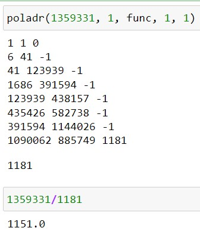

---
## Front matter
title: "Отчет по лабораторной работе №6"
subtitle: "Дисциплина: Математические основы защиты информации и информационной безопасности"
author: "Живцова Анна"

## Generic otions
lang: ru-RU
toc-title: "Содержание"

## Bibliography
bibliography: cite.bib
csl: pandoc/csl/gost-r-7-0-5-2008-numeric.csl

## Pdf output format
toc: true # Table of contents
toc-depth: 2
lof: true # List of figures
lot: true # List of tables
fontsize: 12pt
linestretch: 1.5
papersize: a4
documentclass: scrreprt
## I18n polyglossia
polyglossia-lang:
  name: russian
  options:
	- spelling=modern
	- babelshorthands=true
polyglossia-otherlangs:
  name: english
## I18n babel
babel-lang: russian
babel-otherlangs: english
## Fonts
mainfont: IBM Plex Serif
romanfont: IBM Plex Serif
sansfont: IBM Plex Sans
monofont: IBM Plex Mono
mathfont: STIX Two Math
mainfontoptions: Ligatures=Common,Ligatures=TeX,Scale=0.94
romanfontoptions: Ligatures=Common,Ligatures=TeX,Scale=0.94
sansfontoptions: Ligatures=Common,Ligatures=TeX,Scale=MatchLowercase,Scale=0.94
monofontoptions: Scale=MatchLowercase,Scale=0.94,FakeStretch=0.9
mathfontoptions:
## Biblatex
biblatex: true
biblio-style: "gost-numeric"
biblatexoptions:
  - parentracker=true
  - backend=biber
  - hyperref=auto
  - language=auto
  - autolang=other*
  - citestyle=gost-numeric
## Pandoc-crossref LaTeX customization
figureTitle: "Рис."
tableTitle: "Таблица"
listingTitle: "Листинг"
lofTitle: "Список иллюстраций"
lotTitle: "Список таблиц"
lolTitle: "Листинги"
## Misc options
indent: true
header-includes:
  - \usepackage{indentfirst}
  - \usepackage{float} # keep figures where there are in the text
  - \floatplacement{figure}{H} # keep figures where there are in the text
---

# Цель работы

Изучить алгоритм факторизации Полларда.

# Задание

Реализовать алгоритм факторизации Полладра.

# Теоретическое введение

Задача разложения на множители -- одна из первых задач, использующихся для построения криптосистем с открытым ключем. Подробнее в источниках [@book; @book2].

В данной работе будем использовать $p$-метод Полларда, позволяющий найит нетривиальный делитель числа. Для реализации метода нужно задать сжимающую функцию на конечном множестве. В качестве примера такой функции используется $f(x)= x^2 + 5(mod \ n),$ где $n$ -- число, у которого необходимо найти делитель.  

# Выполнение лабораторной работы

## Программная реализация

Для реализации алгоритма факторизации Полладра на языке Python была написанна следующая функция. 

```python
def poladr(n, c, f, a, b):
    d = nod(max(a-b, n), min(a-b, n))
    print(a, b, d)
    if d < n and d > 1:
        return d
    elif d == 1:
        return None
    a = f(a, n)%n
    b = f(b, n)%n
    b = f(b, n)%n
    return poladr(n, c, f, a, b)        
```  

Тут $n$ -- число, у которого необходимо найти делитель, $f$ -- сжимающая функция, $c$ -- начальное приближение, $a, \ b$ -- текущие параметры алгоритма, использующиеся в рекурсии.

Дополнительно были реализованы функции нахождения наибольшего общего делителя и сжимающая функция на конечном множестве

```python
def nod(a, b):
    if b == 0:
        return 0
    while b != 0:
        a = a%b
        a, b = b, a
    return a  

def func(x, n):
    return (x**2 + 5)%n
```

## Проверка функциональности программы

Функциональность данной функции была протестирована в среде jupyter notebook (см. рис. [-@fig:001]). Функция действительно помогла найти нетривиальный делитель числа. 

{#fig:001}

# Выводы

В данной работе я изучила алгоритм факторизации Полладра, реализовала его программно и протестировала.

# Список литературы{.unnumbered}

::: {#refs}
:::
