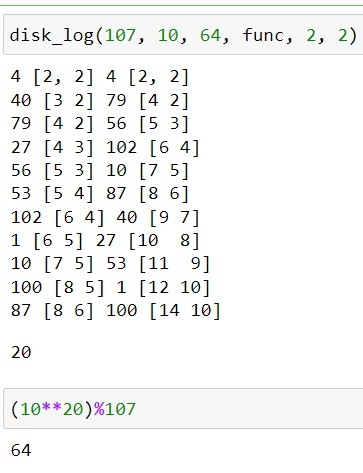

---
## Front matter
title: "Отчет по лабораторной работе №7"
subtitle: "Дисциплина: Математические основы защиты информации и информационной безопасности"
author: "Живцова Анна"

## Generic otions
lang: ru-RU
toc-title: "Содержание"

## Bibliography
bibliography: cite.bib
csl: pandoc/csl/gost-r-7-0-5-2008-numeric.csl

## Pdf output format
toc: true # Table of contents
toc-depth: 2
lof: true # List of figures
lot: true # List of tables
fontsize: 12pt
linestretch: 1.5
papersize: a4
documentclass: scrreprt
## I18n polyglossia
polyglossia-lang:
  name: russian
  options:
	- spelling=modern
	- babelshorthands=true
polyglossia-otherlangs:
  name: english
## I18n babel
babel-lang: russian
babel-otherlangs: english
## Fonts
mainfont: IBM Plex Serif
romanfont: IBM Plex Serif
sansfont: IBM Plex Sans
monofont: IBM Plex Mono
mathfont: STIX Two Math
mainfontoptions: Ligatures=Common,Ligatures=TeX,Scale=0.94
romanfontoptions: Ligatures=Common,Ligatures=TeX,Scale=0.94
sansfontoptions: Ligatures=Common,Ligatures=TeX,Scale=MatchLowercase,Scale=0.94
monofontoptions: Scale=MatchLowercase,Scale=0.94,FakeStretch=0.9
mathfontoptions:
## Biblatex
biblatex: true
biblio-style: "gost-numeric"
biblatexoptions:
  - parentracker=true
  - backend=biber
  - hyperref=auto
  - language=auto
  - autolang=other*
  - citestyle=gost-numeric
## Pandoc-crossref LaTeX customization
figureTitle: "Рис."
tableTitle: "Таблица"
listingTitle: "Листинг"
lofTitle: "Список иллюстраций"
lotTitle: "Список таблиц"
lolTitle: "Листинги"
## Misc options
indent: true
header-includes:
  - \usepackage{indentfirst}
  - \usepackage{float} # keep figures where there are in the text
  - \floatplacement{figure}{H} # keep figures where there are in the text
---

# Цель работы

Изучить алгоритм Полларда для дискретного логарифмирования в конечном поле.

# Задание

Реализовать алгоритм Полларда для дискретного логарифмирования в конечном поле.

# Теоретическое введение

Задача дискретного логарифмирования в конечном поле -- одна из первых задач, использующихся для построения криптосистем с открытым ключем. Эта задача также используется для установления сеансового ключа. Криптоскойкость данных схем основывается на вычислительной сложности решения задачи дискретного логарифмирования. Подробнее в источниках [@book; @book2].

В данной работе будем использовать $p$-метод Полларда, позволяющий решить задачу дискретного логарифмирования в конечном поле порядка $p$, т.е. для нахождения $x$ такого, что $a^x\equiv(mod \ p)$. Для реализации метода нужно задать сжимающую функцию на конечном множестве. Также требуется, чтобы сохранялась возможность вычислить $\log f(c)$ по известному значению $\log c$ и неизвестному $\log b.$ В качестве примера такой функции в данной работе используется кусочная функция 
$$f(x)= \begin{cases}
ax, \text{ если } x < \frac{p}{2}, \\
bx, \text{ если } x \ge \frac{p}{2}. \\
\end{cases}$$  

# Выполнение лабораторной работы

## Программная реализация

Для реализации алгоритма дискретного логарифмирования методом Полладра на языке Python была написанна следующая функция. 

```python
def disk_log(p, a, b, f, u, v):
    c = ((a**u)*(b**v))%p
    c_log = [u, v]
    d = c
    d_log = [u, v]
    while True:
        print(c%p, c_log, d%p, d_log)
        c, c_log_n = func(a, b, c, p)
        c_log += c_log_n
        d, d_log_n = func(a, b, d, p)
        d_log += d_log_n
        d, d_log_n = func(a, b, d, p)
        d_log += d_log_n
        if (c-d)%p == 0:
            order = find_order(a, p)
            cd_log = c_log - d_log
            r = (order - abs(cd_log[0]))
            for i in range(order):
                if (r + i*order)%cd_log[1] == 0:
                    return abs((r + i*order)//cd_log[1])       
```  

Тут $p$ -- порядок поля, $a, \ b$ -- из условия задачи логарифмирования, $f$ -- сжимающая функция, $u, \ v$ -- начальные приближения. 

Дополнительно были реализованы функции нахождения порядка элемента в поле и сжимающая функция на конечном множестве

```python
def find_order(n, p):
    for i in range(1, p):
        if (n**(i))%p == 1:
            return i

def func(a, b, x, p):
    if x < p/2:
        return (a*x)%p, np.array([1, 0])
    return (b*x)%p, np.array([0, 1])
```

## Проверка функциональности программы

Функциональность данной функции была протестирована в среде jupyter notebook (см. рис. [-@fig:001]). Функция действительно помогла решить задачу дискретного логарифмирования. 

{#fig:001}

# Выводы

В данной работе я изучила алгоритм Полладра для решения задачи дискретного логарифмирования в конечном поле. Также я реализовала его программно и протестировала.

# Список литературы{.unnumbered}

::: {#refs}
:::
