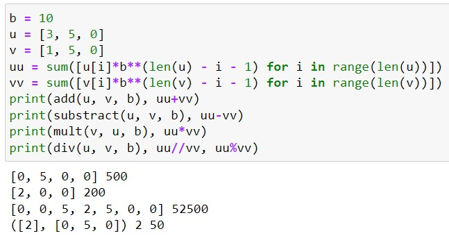

---
## Front matter
title: "Отчет по лабораторной работе №8"
subtitle: "Дисциплина: Математические основы защиты информации и информационной безопасности"
author: "Живцова Анна"

## Generic otions
lang: ru-RU
toc-title: "Содержание"

## Bibliography
bibliography: cite.bib
csl: pandoc/csl/gost-r-7-0-5-2008-numeric.csl

## Pdf output format
toc: true # Table of contents
toc-depth: 2
lof: true # List of figures
lot: true # List of tables
fontsize: 12pt
linestretch: 1.5
papersize: a4
documentclass: scrreprt
## I18n polyglossia
polyglossia-lang:
  name: russian
  options:
	- spelling=modern
	- babelshorthands=true
polyglossia-otherlangs:
  name: english
## I18n babel
babel-lang: russian
babel-otherlangs: english
## Fonts
mainfont: IBM Plex Serif
romanfont: IBM Plex Serif
sansfont: IBM Plex Sans
monofont: IBM Plex Mono
mathfont: STIX Two Math
mainfontoptions: Ligatures=Common,Ligatures=TeX,Scale=0.94
romanfontoptions: Ligatures=Common,Ligatures=TeX,Scale=0.94
sansfontoptions: Ligatures=Common,Ligatures=TeX,Scale=MatchLowercase,Scale=0.94
monofontoptions: Scale=MatchLowercase,Scale=0.94,FakeStretch=0.9
mathfontoptions:
## Biblatex
biblatex: true
biblio-style: "gost-numeric"
biblatexoptions:
  - parentracker=true
  - backend=biber
  - hyperref=auto
  - language=auto
  - autolang=other*
  - citestyle=gost-numeric
## Pandoc-crossref LaTeX customization
figureTitle: "Рис."
tableTitle: "Таблица"
listingTitle: "Листинг"
lofTitle: "Список иллюстраций"
lotTitle: "Список таблиц"
lolTitle: "Листинги"
## Misc options
indent: true
header-includes:
  - \usepackage{indentfirst}
  - \usepackage{float} # keep figures where there are in the text
  - \floatplacement{figure}{H} # keep figures where there are in the text
---

# Цель работы

Изучить и реализовать алгоритмы арифметических операций для больших чисел, записанных в $b$-нарной системе счисления.

# Задание

Реализовать сложение, вычитание, умножение и деление с отсатком для чисел, записанных в виде последовательности символов в  $b$-нарной системе счисления.

# Теоретическое введение

В криптографии часто возникает необходимость работы с большими числами. Для эффективного проведения арифметических операций данные числа удобно хранить в виде последовательности символов в  $b$-нарной системе счисления.  Подробнее в источниках [@book; @book2].

# Выполнение лабораторной работы

Тут $v$ и $u$ -- числа между которыми требуется выполнить бинарную операцию, а $b$ -- основание системы счисления. В переменной $w$ хранится результат выполнения операции.

## Сложение и вычитание   

Для реализации сложения и вычитания больших чисел  на языке Python были написанны следующие функции. 

```python
def add(u, v, b):
    w = []
    k = 0
    for i in range(len(u)-1, -1, -1):
        w.append((u[i] + v[i] + k)%b)
        k = (u[i] + v[i] + k)//b
    w.append(k)
    return w[::-1]

def substract(u, v, b):
    w = []
    k = 0
    for i in range(len(u)-1, -1, -1):
        w.append((u[i] - v[i] + k)%b)
        k = (u[i] - v[i] + k)//b
    return w[::-1]
```  

## Умножение

Было реализовано два вида умножения  

```python
def mult(u, v, b):
    w = [0]*(len(u) + len(v) + 1)
    u = u[::-1]
    v = v[::-1]
    for i in range(len(u)):
        for j in range(len(v)):
            w[i + j] += u[i]*v[j]
    for i in range(len(u)+len(v)):
        w[i + 1] += w[i]//b
        w[i] %= b
    return w[::-1]


def fast_mult(u, v, b):
    w = [0]*(len(u) + len(v))
    t = 0
    for s in range(len(u) + len(v)):
        for i in range(s+1):
            t += u[len(u) - i - 1]*v[len(v)-s+i - 1]
        w[len(u) + len(v) - s - 1] = t%b
        t = t//b
    return w
```

## Деление с остатком

Реализовано с помощью функции  

```python
def div(u, v, b):
    q = [0]*(len(u) - len(v) + 1)
    uu = sum([u[i]*b**(len(u) - i - 1) for i in range(len(u))])
    vv = sum([v[i]*b**(len(v) - i - 1) for i in range(len(v))])
    while uu >= vv*(b**(len(u) - len(v))):
        q[len(u) - len(v)] += 1
        u = substract(u, v + [0]*(len(u) - len(v)), b)
        uu -= vv*(b**(len(u) - len(v)))        
    for i in range(len(u), len(v), -1):
        if u[i] >= v[len(v)]:
            q[i - len(v) - 1] = b - 1
        else:
            q[i - len(v) - 1] = (u[i]*b + u[i-1])//v[len(v)]
        while q[i - len(v) - 1]*(u[len(v)]*b + u[len(v)-1]) > u[i]*b*b + u[i-1]*b + u[i-2]:
            q[i - len(v) - 1] -= 1
        arr = mult(v+[0]*(i - len(v) - 1), q[i - len(v) - 1], b)
        u = substract(u, arr, b)
        uu -= q[i - len(v) - 1]*b**(i - len(v) - 1)*vv
        if uu < 0:
            uu += vv*b**(i - len(v) - 1)
            u = add(u, v+[0]*(i - len(v) - 1))
            q[i - len(v) - 1] -= 1
    return [i%b for i in q], u 
```

## Тестирование функций

Реализованные функции были протестированы на примере трехзначных десятичных чисел (см. рис. [-@fig:005]). Все результаты оказались верными.

{#fig:001}

# Выводы

В данной работе я изучила и реализовала алгоритмы арифметических операций для больших чисел, записанных в $b$-нарной системе счисления. Реализованные мной сложение, вычитание, умножение и деление с остатком были протестированы на трехзначных десятичных числах.

# Список литературы{.unnumbered}

::: {#refs}
:::
